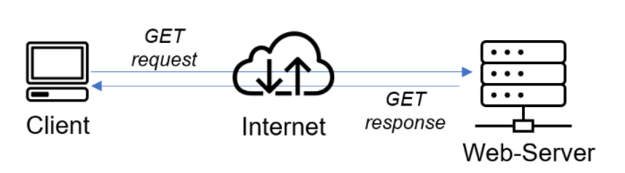
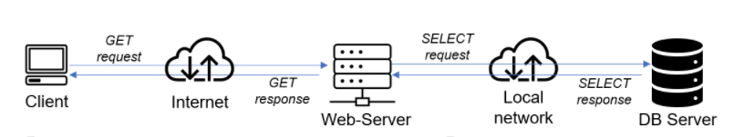

# A Client-Server Archictecture using the implementation of MySQL Database Management (RDMS)

### Client-Server refers to an architecture in which two or more computers are connected together over a network to send and receive requests between one another.

### In their communication, each machine has its own role: the machine sending requests is usually referred as "Client" and the machine responding (serving) is called "Server".

*Fig.1 Client-Server Architecture-Basic*

### Fig.2 shows, a Web Server has a role of a "Client" that connects and reads/writes to/from a Database (DB) Server (MySQL, MongoDB, Oracle, SQL Server or any other), and the communication between them happens over a Local Network (it can also be Internet connection, but it is a common practice to place Web Server and DB Server close to each other in local network). 

*Fig.2 Client-Server Architecture-RDMS*

