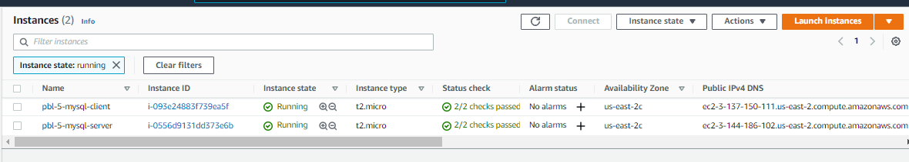
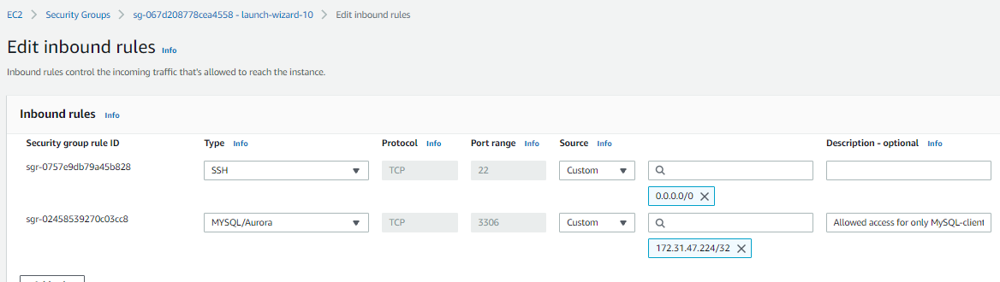
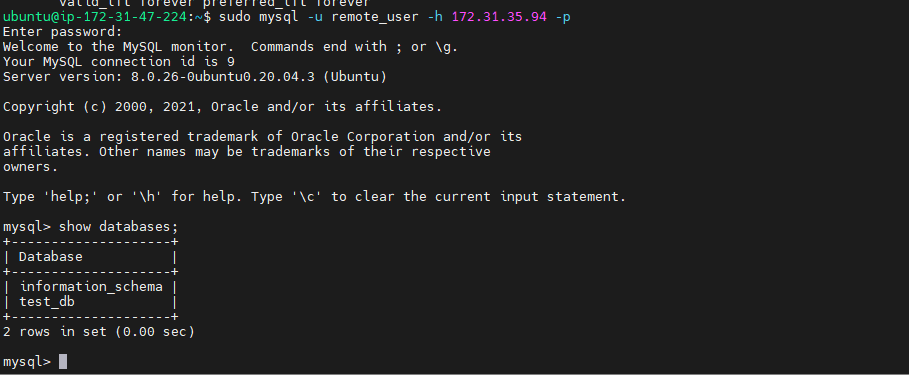

# A Client-Server Archictecture using the implementation of MySQL Database Management (RDMS)

### Client-Server refers to an architecture in which two or more computers are connected together over a network to send and receive requests between one another. In their communication, each machine has its own role: the machine sending requests is usually referred as "Client" and the machine responding (serving) is called "Server".

*Fig.1 Client-Server Architecture-Basic*

### Fig.2 shows, a Web Server has a role of a "Client" that connects and reads/writes to/from a Database (DB) Server (MySQL, MongoDB, Oracle, SQL Server or any other), and the communication between them happens over a Local Network (it can also be Internet connection, but it is a common practice to place Web Server and DB Server close to each other in local network). 

*Fig.2 Client-Server Architecture-RDMS*

#### Step 0 – Spun-off EC2 Instances of Linux Ubuntu Server and Applied basic configurations

Launched EC2 instance of Linux Ubuntu Server 20.04 LTS (HVM) and named it as pbl_p5_mysql-server and pbl_p5_mysql-client. Created security group with SSH port opened and also created and saved my private key to be used for SSH into the EC2 instance. 

*EC2 Instances-MySQL server and client*

Opened port 3306 on MySQL-server and allowed access only to MySQL-client IP-172.31.47.224/32

*Security group for mysql-server*

### A)  Installation of MySQL-Server

ubuntu@ip-172-31-35-94:~$
`sudo apt update`
`sudo apt install mysql-server`
`sudo systemctl enable mysql`

Database password validation

`sudo mysql_secure_installation`

configure MySQL server to allow connections from remote hosts by editing file mysqld.cnf,  that is, change the binding address from 127.0.0.1 to 0.0.0.0. 

`sudo vi /etc/mysql/mysql.conf.d/mysqld.cnf `

Then restart mysql afterwards

`sudo systemctl restart mysql`

Login to MySQL

`sudo mysql`

mysql>

@mysql prompt,

created new database user-remot_user, password-'password' and the database-test_db  
     
  `  CREATE USER 'remote_user'@'%' IDENTIFIED WITH mysql_native_password BY 'password';`
  `  CREATE DATABASE test_db;`
  `  GRANT ALL ON test_db.* TO 'remote_user'@'%' WITH GRANT OPTION;`
  `  FLUSH PRIVILEGES; `
  `  exit `

### B)  Installation of MySQL-Client

ubuntu@ip-172-31-47-224:~$

`sudo apt update -y`
`sudo apt install mysql-client -y`

Provided access/logon details into mysql-server (172.31.35.94)

`sudo mysql -u remote_user -h 172.31.35.94 -p`

*MySQL_Client Prompt*

